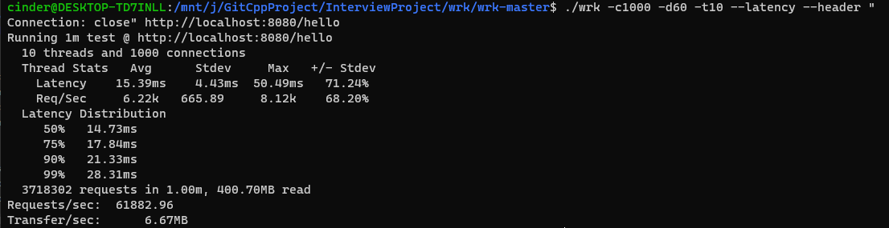
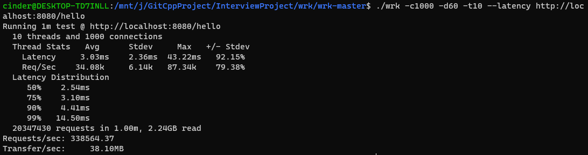

# TcpServer

A C++ High Performance TcpSerer

# 简介

本项目使用C++11，是一个基于epoll的多线程tcp服务器，使用TcpServer实现了一个简单的HTTP应用，目前支持GET请求，以及HTTP长连接。基于该tcp服务器，可以扩展很多的应用层服务器。

# 项目起源

* 学习了好几个月的c++，却一直没有机会完成一个项目，此时正好在读陈硕大佬的《Linux多线程服务端编程 》，书的第8章讲的就是moduo的设计与实现，于是就决定边学边做。一开始读感觉很吃力，很多地方都不太理解，所以只能反复的读，细细的品，期间也参考了大量的文档与书籍(Linux-UNIX系统编程手册)来帮助自己理解，等感觉一些知识点理解的差不多了，就开始自己模仿，并慢慢推进，直到最终磨出了这个项目。

# 项目目的

* 学习c++编程规范，c++语法，TCP、HTTP协议，linux系统调用函数，多线程，Reactor网络模式，cmake的使用，git的使用

# 环境

* OS: WSL2 Ubuntu-20.04
* Complier:9.3.0

# 生成

```
./build.sh
```

#  用法

```
./server [port] [iothreadnum]

默认端口是8080，IO线程数是4(不包括主线程)
```

# 技术点

* 基于epoll的IO多路复用，使用边缘触发，以及非阻塞IO
* 使用timerfd和时间堆实现定时器，并采用延时删除(只有定时器在堆顶时才会删除)。支持复用定时器(避免多一次new 和 delete，同时能避免时间堆的膨胀)
* 使用多Reactor多线程模型，主线程负责accept连接请求，并通过Round-Robin的方式选择一个IO线程进行分发，IO线程负责处理read，write事件。

* 使用智能指针管理管理资源，避免内存泄露

* 支持优雅关闭连接，主动发送`FIN`或者对端发送`FIN`之前都会检查数据是否写完。

# 性能测试

## 测试环境

* OS: WSL2 Ubuntu-20.04
* CPU: Intel(R)Core(TM) i7-6700K CPU @4.00GHz
* 内存：16G

## 测试方法

* 使用本地环境测试HttpServer，默认开启4个IO线程
* 关闭所有打印，关闭Nagle算法
* 使用[wrk](https://github.com/wg/wrk)工具，开启1000个连接，持续60s

## 测试结果

* HttpServer短连接测试



* HttpServer长连接测试

